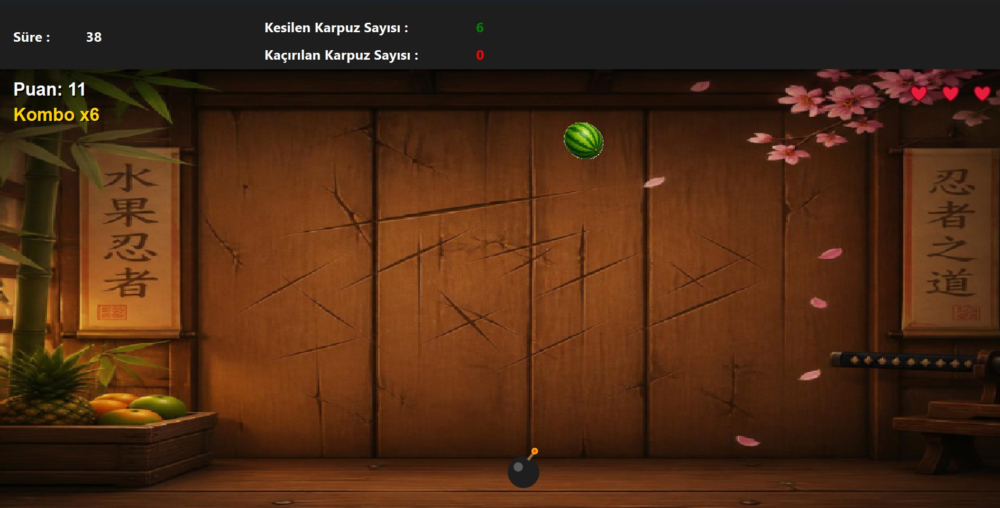

# Watermelon Slicer (Qt / C++)

Qt Widgets ile yazılmış, fareyle meyve kesme oyunu. Görsel Programlama dersi için yaptığım bir okul projesidir, ders gereksinimlerinin ötesine geçen yeni özelliklerle genişletilmiş bir versiyondur.

## Özellikler

- Fareyi sürükleyerek meyve kesme ve solarak kaybolan kesme izi
- 3 can sistemi: kaçırılan meyve ya da kesilen bomba can götürür
- Kodla çizilmiş bomba ve kalp göstergeleri
- Kombo sistemi: arka arkaya kesince bonus puan
- Zamanla artan zorluk: daha hızlı ve daha sık düşen meyveler, rastgele konumlar
- En iyi 5 skor tablosu (skorlar kullanıcının AppData klasöründe tutulur)

## Derleme

Gereksinimler: Qt 6 (Widgets) ve bir C++17 derleyicisi.

1. Qt Creator'da `.pro` dosyasını aç (dosya adını buraya yaz).
2. Bir Kit seç (örn. Desktop Qt 6 MinGW 64-bit) ve **Configure Project**'e bas.
3. **Ctrl+R** ile çalıştır.

## Görseller hakkında

Meyve ve arka plan görselleri Canva ile tarafımdan tasarlanmıştır.
Bomba, kalp, kesme izi ve diğer efektler kodla çizilmiştir.

## Not

Bu proje ticari bir ürün değildir ve herhangi bir oyun markasıyla bağlantısı yoktur.
